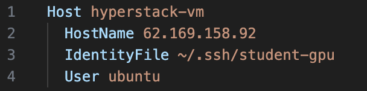

# Requirements 
- Hyperstack account
- Huggingface account & token
- Wandb account & token

# Setup
- Create GPU on Hyperstack (detailed guide is below)
- Setup & Run init.sh

## Creating & Connecting a Hyperstack GPU

1. Go to the ``Virtual Machines`` tab and select `Deploy New Virtual Machine`

---
2. Select the GPU Flavor that according to your needs. Remember that more powerful GPUs are more expensive and you are on a limited budget.

---
3. Check the Environment (Region) in which your machine will run. The selected default should usually be okay.

---
4. Select the image you want to have for the machine. An Ubuntu image is a good default. It is also possible to create an upload custom images for more professional setups.

---
5. Configure access to your VM machine. Select the SSH key student-gpu, which you will receive per email. If you have not send a mail to ``christophhoertnagl@gmail.com`` to request it. Then enable both, ``SSH Access`` and `Public IP Address`.

---
6. Give the VM a name that has 2 properties `<Your Name>-<GPU Flavour>`. You can find this under additional settings.

---
7. Click on Deploy

---
8. Wait until the status is `Active` and then copy the `Public IP of VM`.

---
9. Enable SSH access on your machine:
    1. Place your ssh key where you usually have them (e.g. ~/.ssh)
    2. run chmod 600 `~/.ssh/student-gpu` (obviously use your path and keyfile name)
    3. Open your ssh config file (e.g. in VS Code)
    4. Create entry in config file Enter IP from page as `HostName`, path to key file as ``IdentityFile`` and ``User`` as ``ubuntu`` (see screenshot for a final example)

---
10. In VS Code use ``Remote-SSH`` command and select the name you gave it, in the example it is `hyperstack-vm`
    1. Type `nvidia-smi`to check if your GPU works
    2. Add your ``HF_TOKEN``and your ``WANDB_API_KEY`` to ``init.sh`` (optionally also mail and name for github if you plan to push code from your VM)
    3. `chmod +x init.sh` and `./init.sh`, now every new terminal will have the correct environment variables set for Machine Learning code.

---
**Congrats you are good to code!**